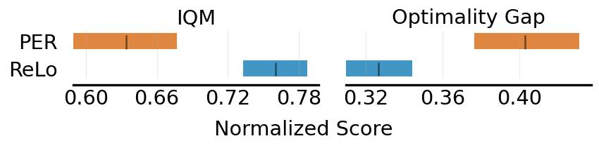
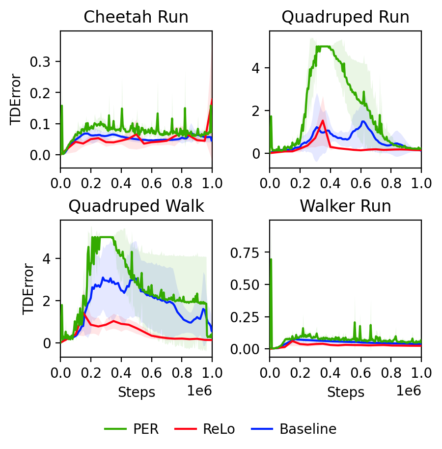

# Prioritizing Samples in Reinforcement Learning with Reducible Loss

[Shivakanth Sujit](http://shivakanthsujit.github.io/), [Somjit Nath](https://somjit77.github.io/), [Pedro Braga](https://phbraga.com/), [Samira Ebrahimi Kahou](https://saebrahimi.github.io/)

[](https://arxiv.org/abs/2208.10483)

This repo provides code for the ReLo prioritization scheme. You can find a TLDR of the method [here](https://twitter.com/ShivaSujit/status/1569674176931176448) and slides accompanying the paper [here](https://drive.google.com/file/d/1ug2Z1GqWDpYIEvdx1m9BVImm0fphhJvK/view?usp=sharing).

If you find our work useful, please cite us in your paper. 

```
@article{sujit2022prioritizing,
  title   = {Prioritizing Samples in Reinforcement Learning with Reducible Loss},
  author  = {Shivakanth Sujit and Somjit Nath and Pedro H. M. Braga and Samira Ebrahimi Kahou},
  year    = {2022},
  journal = {arXiv preprint arXiv: Arxiv-2208.10483}
}
```

## Overview

Most reinforcement learning algorithms take advantage of an experience replay buffer to repeatedly train on samples the agent has observed in the past. This prevents catastrophic forgetting, however simply assigning equal importance to each of the samples is a naive strategy. In this paper, we propose a method to prioritize samples based on how much we can learn from a sample. We define the learn-ability of a sample as the steady decrease of the training loss associated with this sample over time. We develop an algorithm to prioritize samples with high learn-ability, while assigning lower priority to those that are hard-to-learn, typically caused by noise or stochasticity. We empirically show that our method is more robust than random sampling and also better than just prioritizing with respect to the training loss, i.e. the temporal difference loss, which is used in vanilla prioritized experience replay.

<br>
<center>


*Performance of PER and ReLo aggregated over 21 environments and 5 seeds.*

<br>


*Comparison of TD errors during training of a baseline SAC agent with ReLo and PER.*
</center>

## Integrating ReLo

Two line summary: It is very simple to integrate ReLo into an off policy Q Value RL algorithm that currently uses PER. Instead of setting the priority to the TD error, set it to the difference between the TD error wrt the online network and the target network. 

A more indepth algorithm can be found [here](assets/algo.png) and for more details please refer to the paper.

## Usage of Repo
The codebases for each benchmark are present in a separate folder. Each folder contains a `scripts` folder that contains the files to reproduce the results in the paper.

### Experiment running
To start the runs for each benchmark, you can use the `run.sh` file in the `scripts` folder. It will start the runs for each environment in the benchmark.

In the run script you can choose which algorithm to run. Whether it is the baseline version, the PER verion or the ReLo version.

Each codebase contains the instructions required to set it up from the original authors. No additional setup is required to run the code.

### Plotting

Each `scripts` folder has a `plot.sh` that can be run to produce the main plots from the paper. There is a `results` folder for each benchmark that contains the figures from the paper as well as data that can be used to recreate the figure. There is a CSV with final scores of each environment and benchmark presented in the paper.

## Acknowledgements

* The MinAtar codebase is modified from the official [codebase](https://github.com/kenjyoung/MinAtar) for the MinAtar environment.
* The SAC codebase is modified from [here](https://github.com/denisyarats/pytorch_sac).
* The Rainbow codebase is modified from [here](https://github.com/Kaixhin/Rainbow).